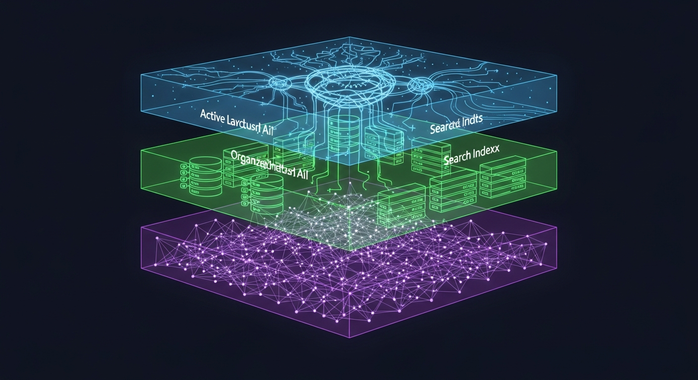

If you've spent enough time with AI coding assistants, you've hit the wall. That moment where your assistant forgets the decision you made 20 minutes ago, or confidently re-suggests something you already rejected three turns back.

I've been running autonomous AI workers on my projects (yeah, I have a whole orchestrator setup — it's a thing), and the memory problem keeps biting me. Claude Code has its `compact` skill that summarizes the context window, but summarization is inherently lossy. The more you compress, the more detail evaporates. Eventually your assistant is working from a summary of a summary of a summary, and the nuance is gone.

So I did what any reasonable person would do: I asked three different AIs to research how to fix this problem.

## The Prompt (Typos and All)

I sent essentially the same research prompt to three models:

> I want you to research methods to improve LLM short term, long term and memory persistency... My intention is that an assistant agent can be spun up with that same memory agnostic of the LLM.

The research squad:
- **Claude Sonnet 4.5** with extended thinking + web search
- **ChatGPT 5.2** with deep research
- **Gemini 3 Pro** with deep thinking

And honestly? They largely agreed. Which either means we've converged on the right answer, or all three are reading the same papers. (Probably both.)

## The Three-Tier Architecture Everyone Agrees On

All three models independently arrived at the same fundamental insight: you need **three distinct layers of memory**, not just one.

**Tier 1: Working Memory** — This is what lives inside the context window right now. Your system prompt, recent conversation turns, retrieved snippets, current task state. It's the only thing the LLM can actually "see." The key insight from Anthropic's own guidance: allocate roughly 10-15% for system instructions, 20% for summarized history, ~50% for recent raw messages, and keep 10% reserved for on-demand retrieval.

**Tier 2: Session Store** — The complete conversation history, indexed and searchable. SQLite with FTS5 is the unanimous recommendation here. It's battle-tested, single-file, ACID-compliant, and gives you sub-millisecond keyword search across hundreds of thousands of records. No infrastructure needed.

**Tier 3: Long-term Semantic Memory** — This is where it gets interesting. Vector embeddings of distilled facts, user preferences, and learned patterns stored in something like ChromaDB or FAISS. This tier lets you search by *meaning*, not just keywords.

```
┌──────────────────────────────────────────┐
│           LLM CONTEXT WINDOW             │
│  System prompt + key facts + summary     │
│  + retrieved memories + recent messages   │
├──────────────────────────────────────────┤
│         SHORT-TERM BUFFER                │
│  SQLite + FTS5: full session history,    │
│  metadata, token counts, timestamps      │
├──────────────────────────────────────────┤
│         LONG-TERM MEMORY                 │
│  ChromaDB: semantic embeddings + metadata│
│  Graph DB: entity relationships          │
│  Markdown: human-readable persistent ctx │
└──────────────────────────────────────────┘
```

## The "Model-Agnostic" Part That Matters

Here's the thing that excited me most. If you design memory as an external system — with a clean API like `put(event)`, `search(query)`, `summarize(scope)`, `compact(budget)` — then the LLM becomes a swappable black box. You could spin up a worker with Llama, switch to Claude for a complex task, and they'd share the same memory.

The LLM Adapter layer handles the differences: prompt formatting, tokenization (BPE vs SentencePiece), context length budgets. But the memory itself? Universal.

ChatGPT's research called out a practical minimal interface:

```
MemoryStore:
  put_event(event: {text, type, timestamp, source, metadata}) -> event_id
  put_fact(fact: {subject, predicate, object, confidence, provenance}) -> fact_id
  search(query: {text, filters}, k, mode: dense|sparse|hybrid) -> [MemoryItem]
  summarize(scope: {ids|time_range|topic}, style) -> SummaryItem
  compact(policy: {budget, preserve_rules}) -> CompactResult
  delete(item_id|filter) -> DeletionReceipt
```

## What's Already Out There

The landscape of drop-in memory frameworks is surprisingly mature:

- **Mem0** (~47K GitHub stars) — Simplest integration. `memory.add()` extracts facts via LLM, `memory.search()` retrieves semantically. Claims 26% higher accuracy than OpenAI's memory on LoCoMo benchmark with 91% lower latency. Runs fully local with Ollama + ChromaDB.
- **Letta** (formerly MemGPT, ~21K stars) — The most sophisticated. Treats the LLM like a CPU managing its own RAM. The LLM uses tool calls to page memory in and out. Powerful, but needs Docker + PostgreSQL.
- **OpenMemory** (~2.7K stars) — Newest contender. Five cognitive memory sectors (episodic, semantic, procedural, emotional, reflective), temporal knowledge graphs, sector-specific memory decay. Ships as an MCP server.

And then there's the simplest approach that everyone keeps rediscovering: **markdown files loaded at session start**. It's what Claude Code does with `CLAUDE.md`, what Cline does with Memory Bank, and it works shockingly well for 80% of use cases.

## The Surprising Finding: Structure Beats Summarization

Perhaps the most actionable insight came from Factory.ai's evaluation of 36,000+ messages across compression approaches. Freeform summarization scored **3.35/5** on information retention. Structured summarization (with dedicated sections for entities, decisions, constraints) scored **3.70/5**.

The lesson: before you compress anything, extract structured facts first:

```python
structured_facts = {
    "entities": ["auth.controller.ts", "Redis", "JWT"],
    "decisions": [{"decision": "Use connection pooling",
                   "reason": "Prevent stale connections"}],
    "action_items": ["Add retry logic", "Fix mock setup"],
    "preferences": ["User prefers TypeScript"],
    "constraints": ["Only modify auth module"]
}
```

These facts persist in the always-loaded scratchpad even after the narrative gets compressed. **Structure forces preservation** — dedicated sections act as checklists that can't be silently dropped during summarization.

## Where I'm Going With This

I'm not building a full memory framework (yet). But understanding these patterns is directly influencing how I set up my autonomous workers. Right now my orchestrator uses markdown-based communication files (TASKS.md, PROGRESS.md) — which turns out to be the exact "file-based persistent memory" pattern that all three AIs independently validated.

The next step would be adding a lightweight vector store (ChromaDB, a single pip install) so workers could semantically search previous decisions and progress across projects. Imagine spinning up a dev worker on TROTA and having it automatically recall "last time we added OAuth to a project, we used authlib and it worked well" — not because someone wrote that in a task file, but because the memory system surfaced it from previous sessions.

The full research is up on [GitHub](https://github.com/datdiego/llm_memory) if you want to dig into the raw outputs from each model. Fair warning: ChatGPT's deep research output alone is 500+ lines of citations. The AI really went off.

## TL;DR

- LLM memory is best solved as a **three-tier system**: working context, session store (SQLite), and semantic memory (vector DB)
- **Model-agnostic design** is the way — decouple memory from inference so any LLM can benefit
- **Structured extraction before compression** is the single highest-impact technique for preventing information loss
- **Markdown files are still elite** for persistent context — simple, universal, human-editable
- The ecosystem is mature: Mem0, Letta, ChromaDB all work locally without cloud dependencies
- Start simple (SQLite + markdown), add complexity only when you hit real limits
